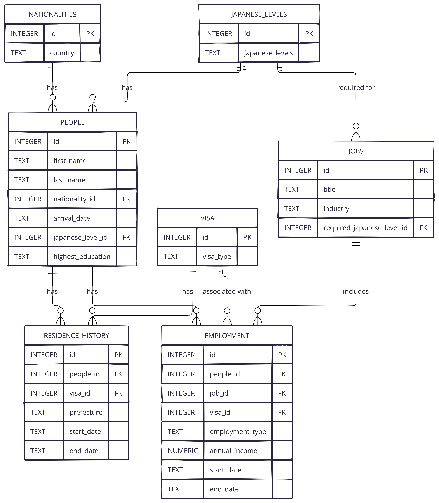

# Design Document

By Gian Morcilla

Video overview: <[URL HERE](https://youtu.be/qnEFXJLleZg)>

## Scope

This database is designed to store information regarding foreigners living in Japan. Since this database records information about the type of nationality the foreigener has, their level of Japansese, education history, status of residence, and employment history, it allows for easier data pulling with any matter related to foreigners living in Japan. This includes matters such as how long a foreigner usually has a certain visa status before switching to a different one, what types of level of Japanese is most commonly required to get a certain type of visa status and certain amount of annual income.

The database contains information about

* Basic information of foreigners living in Japan
* Nationalities
* Level of Japanese
* Residence history
* Visa status
* Jobs
* Employment History

## Functional Requirements

The user of this database should be able to do the following:
* View information about foreigners living in Japan, their nationality, their arrival date, their level of Japanese, and the highest education they were able to obtain.
* Be able to view their residence history, including which prefecture they lived in Japan and the status of their visa including how long they had that certain type of visa before changing to another.
* View information regarding their employment, the annual income they have and the necessary level of Japanese required for the job. This makes it easier to identify the relationship between levels of Japanese, types of visa, job industry, and annual income.
* This data can also help and filter nationality, levels of Japanese, education, prefecture, visa status, and employment.

## Representation

### Entities

The database includes the following entities:

#### Nationalities

The `nationalities` table includes:

* `id`, which specifies the unique ID for the nationalities as an `INTEGER`. This column thus has the `PRIMARY KEY` constraint applied.
* `country`, which specifies the name of the country to represent the nationalities living in Japan as `TEXT`. The `NOT NULL` constraint ensures that each person is tied to a nationality and the `UNIQUE` constraint ensures there are no duplicate countries and is tied to one `id`.

#### Japanese Levels

The `japanese_levels` table includes:

* `id`, which specifies the unique ID for the student as an `INTEGER`. This column thus has the `PRIMARY KEY` constraint applied.
* `japanese_levels`, which specifies the profeciency level in Japanese as a `TEXT`. The `CHECK` constraint ensures that the levels of Japanese is predefined according only to the following `Zero`, `N5`, `N4`, `N3`, `N2`, `N1`, or `Native`.

#### People

The `people` table includes:

* `id`, which specifies the unique ID for the people student as an `INTEGER`. This column thus has the `PRIMARY KEY` constraint applied.
* `first_name`, which specifies the person's first name as a `TEXT`. The `NOT NULL` constraint ensures that each person has a first name.
* `last_name`, which specifies the person's last name as a `TEXT`. The `NOT NULL` constraint ensures that each person has a last name.
* `nationality_id`, which specifies the id of the person's nationality as an `INTEGER`. This column has the `FOREIGN KEY` constraint applied that references the id from the `nationalities` table. The `NOT NULL` constraint ensures that every person has a nationality id.
* `arrival_date`, which specifies the date when the person arrived in Japan as a `TEXT` in order to follow the format yyyy-mm-dd. The `NOT NULL` constraint ensures that each person has an arrival date when coming to Japan.
* `japanese_level_id`, which specifies the id of the person's level of Japanese as an `INTEGER`. This column has the `FOREIGN KEY` constraint applied that references the id from the `japanese_level` table. The `NOT NULL` constraint ensures that every person has a Japanese profeciency table.
* `highest_education`, which specifies the person's highest level of education attained as a `TEXT`. The `NOT NULL` constraint ensures that there is a record of their highest education attained. The `CHECK` constraint ensures that only `NONE`, `High School`, `Bachelor's`, `Master's`, or `Doctorate` can be entered.

#### Residence History

The `residence_history` table includes:

* `id`, which specifies the unique ID for the residence hisotry as an `INTEGER`. This column thus has the `PRIMARY KEY` constraint applied.
* `people_id`, which specifies the id of the person as an `INTEGER`. This column has the `FOREIGN KEY` constraint applied that references the id from the `people` table. The `NOT NULL` constraint ensures that every person has an id.
* `visa_id`, which specifies the id of the visa the person currentlty has as an `INTEGER`. This column has the `FOREIGN KEY` constraint applied that references the id from the `visa` table. The `NOT NULL` constraint ensures that every person has a visa type id.
* `prefecture`, which specifies the prefecture in Japan the person lives in as a `TEXT`. The `NOT NULL` constraint ensures that the prefecture each person lives in is recorded.
* `start_date`, which specifies the start date a person lived tied to their visa type and which prefecture as a `TEXT` in order to follow the format yyyy-mm-dd. The `NOT NULL` constraint ensures there is a start date for their residence history.
* `end_date`, which specifies the end date a person lived tied to their visa type and which prefecture as a `TEXT` in order to follow the format yyyy-mm-dd. This does not containt a `NOT NULL` constraint in case they are still currently living in their respective prefecture with their current visa type.

#### Visa

The `visa` table includes:

* `id`, which specifies the unique ID for the visa as an `INTEGER`. This column thus has the `PRIMARY KEY` constraint applied.
* `visa_type`, which specifies the type of visa the person has as a `TEXT`. The `NOT NULL` constraint ensures that each person has a visa type recorded. The `CHECK` constraint ensures that only `Diplomat`, `Official`, `Professor`, `Artist`, `Religious Activities`, `Journalist`, `Highly Skilled Professional`, `Business Manager`, `Legal/Accounting Services`, `Medical Services`, `Researcher`, `Instructor`, `Engineer/Specialist in Humanities/International Services`, `Intra-company Transferee`, `Nursing Care`, `Entertainer`, `Skilled Labor`, `Specified Skilled Worker`, `Technical Intern Training`, `Cultural Activities`, `Temporary Visitor`, `Student`, `Trainee`, `Dependent`, `Designated Activities`, `Permanent Resident`, `Spouse or Child of Japanese National`, `Spouse or Child of Permanent Resident`, `Long Term Resident` can be entered.

#### Jobs

The `jobs` table includes:

* `id`, which specifies the unique ID for the jobs as an `INTEGER`. This column thus has the `PRIMARY KEY` constraint applied.
* `title` which specifies the title of the job as a `TEXT`. The `NOT NULL` constraint ensures there is a title for the job.
* `industry`, which specifies the industry of the job as a `TEXT`. The `NOT NULL` constraint ensures that the industry of the job is recorded.
* `required_japanese_level_id`, which specifies the id of the required level of Japanese for the job as an `INTEGER`. This column has the `FOREIGN KEY` constraint applied that references the id from the `japanese_level` table. The `NOT NULL` constraint ensures that there is a required level of Japanese for the job is recorded.

#### Employment

The `employment` table includes:

* `id`, which specifies the unique ID for the employment as an `INTEGER`. This column thus has the `PRIMARY KEY` constraint applied.
* `people_id`, which specifies the id of the people as an `INTEGER`. The `NOT NULL` constraint ensures that the people taking on the job is recorded.
* `job_id`, which specifies the id of the job as an `INTEGER`. The `NOT NULL` constraint ensures that the job is recorded.
* `visa_id`, which specifies the id of the visa as an `INTEGER`. The `NOT NULL` constraint ensures that the visa type is being recorded.
* `employment_type`, which specifies the type of employment the person has as a `TEXT`. The `NOT NULL` constraint ensures the type of employment is recorded. The `CHECK` constraint only that only `Permanent`, `Contract`, `Part-time`, `Temporary`, and `Dispatched` can be entered.
* `annual_income` which specifies the annual income the person has as a `NUMERIC`. The `NOT NULL` constraint ensures that the annual income is recorded.
* `start_date`, which specifies the start date of the person's employment as a `TEXT` in order to follow the format yyyy-mm-dd. The `NOT NULL` constraint ensures there is a start date for their emplyoment.
* `end_date`, which specifies the end date of a person's employment as a `TEXT` in order to follow the format yyyy-mm-dd. This does not containt a `NOT NULL` constraint in case they are still currently in that employment.

### Relationships

The below entity relationship diagram describes the relationships among the entities in the database.

diagram.png

As detailed by the diagram:

* Each `people` is only associated with one `nationalities`, while the `nationalities` can be associated with one to many `people`.
* Each `people` is only assocaited with one `japanese_levels` while `japanese_levels` can be associated with one to many people. This can also be updated in the `people` table in case a person's japanese profeciency has advanced.
* Each `people` can have multiple data that can also be updated in the `residence_history`, allowing the database to represent their time in each prefecture and the type of visa they had.
* Each `residence_history` is only associated with one `visa` which means they can only have one visa type at a certain period, which `residence_history` can have multiple records in the scenario where they change their visa type.
* Each `jobs` is required one `japanses_levels`, while they `japanese_levels` has a one to many relationsip with `jobs`.
* Each `people` is associated wih a one to many relationship with `employment` to represent different periods of their employment.
* Each `employment` is associated with one `jobs`, while `jobs` can have a one to many relationship with `employment`.
* Each `employment` is associated with one `visa`, while `visa` has a one to many relationship with `employment` that varies on the required visa type.

## Optimizations

For optimization I created one view:

* `Jobs Information` has all the necessary common information compiled into one table that most foreigners would want to know when it comes to this database. This includes the title of the job, what industry, visa type, employment type, and the required level of Japanese

I also created several indexes based on the most common queries that will be used in this database.

* `people_nationalities_index`
* `employment_annual_income_index`
* `residence_history_end_date_visa_id_index`
* `employment_annual_end_date_index`
* `residence_history_prefecture_index`
* `employment_people_index`

## Limitations

Limitations of my design are as follows

* `japanese_levels` - In this table, there can only be one level of japanese per person, and although this can easily be updated there is a big ambiguity when it comes to the level of a person's language. A person might be able to speak, but not write, or read, but not speak. There are also the case where some foreigeners do not have any certification when it comes to their knowledge in Japanese but can be at the same level as a Native. There are cases as well where a foreigenr would be on the lowest level on paper when it comes to their level of Japanese but is actualy close to fluent and was able to get a job that does not usually match that level.

* `employment` - In this table, the database only has data on small information regarding employment and could use more data such as the name of the company, whether there is overtime work or not, and many more.

* `jobs` - In this table, the main factor in being able to get the job is their required level of Japanese. Although it is possible to compare the highest attained education from the `people` table, some of this can be inconsistent or could use some more information.
